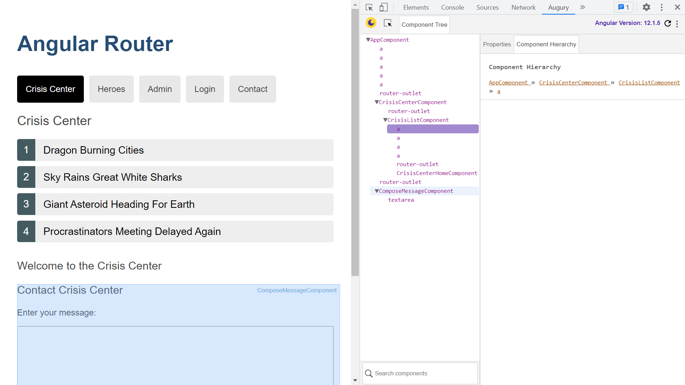

# :zap: Nx Angular Router

* Angular Tour of Heroes app converted to Nx monorepo
* Tutorial code from [Lars Gyrup Brink Nielsen](https://www.youtube.com/c/LarsGyrupBrinkNielsen/videos)
* **Note:** to open web links in a new window use: _ctrl+click on link_


## :page_facing_up: Table of contents

* [:zap: Nx Angular Router](#zap-nx-angular-router)
  * [:page_facing_up: Table of contents](#page_facing_up-table-of-contents)
  * [:books: General Info](#books-general-info)
  * [:camera: Screenshots](#camera-screenshots)
  * [:signal_strength: Technologies](#signal_strength-technologies)
  * [:floppy_disk: Setup](#floppy_disk-setup)
  * [:computer: Code Examples](#computer-code-examples)
  * [:clipboard: Status & To-Do List](#clipboard-status--to-do-list)
  * [:clap: Inspiration](#clap-inspiration)
  * [:file_folder: License](#file_folder-license)
  * [:envelope: Contact](#envelope-contact)

## :books: General info

* [Angular Router tutorial: tour of heroes](https://angular.io/guide/router-tutorial-toh) used as starter code
* Nx uses a single repo for both frontend and backend apps with a shared library.
* Nx ensures that adding another app to the repo does not increase existing test or build times.
* Uses computational caching - so test and lint tasks are not repeated on unchanged code.
* Note: converted Nx app folder size is nearly 0.5 GB

## :camera: Screenshots



## :signal_strength: Technologies

* [Nx with Angular plugin](https://nx.dev/angular) used to create project workspace
* [Angular framework v12](https://angular.io/)
* [@nrwl/workspace v12](https://yarnpkg.com/package/@nrwl/workspace) to transform the Angular CLI workspace to an Nx workspace
* [rxjs v6](https://rxjs.dev/) Reactive extensions library
* [Nx Console: VS Code extension](https://marketplace.visualstudio.com/items?itemName=nrwl.angular-console)

## :floppy_disk: Setup

* Install nx globally
* In app, install dependencies using `yarn`
* `nx dep-graph` to see a diagram of the dependencies of your projects.
* `yarn start` to start app on a dev. server
* `nx serve` for a dev server. Frontend will open at `http://localhost:4200/` - refreshes on code changes
* `npx nx build nx-angular-router`

**Nest Backend:**

* `npx nx serve api` to serve the backend
* `npx nx build api` to build the backend
* `npx nx test api` to test the backend

## :wrench: Testing

* `npx nx e2e todos-e2e --watch` for end to end testing of todos app
* `npx nx test` to test todos app - tests need fixing

## :computer: Code Examples

* tba

```typescript

```

## :cool: Features

* tba

## :clipboard: Status, To-Do List

* Status: Working.
* To-Do: Complete

## :clap: Inspiration/General Tools

* [Lars Gyrup Brink Nielsen - Nx After Dark: Migrating an Angular CLI workspace to Nx](https://www.youtube.com/watch?v=5Z55XxZnFkE)
* [Lars Gyrup Brink Nielsen - Nx After Dark: Extracting features into workspace libraries](https://www.youtube.com/watch?v=7MtQXPIpUoc&t=169s)
* [Nx: Transitioning to Nx](https://nx.dev/latest/angular/migration/migration-angular)

## :file_folder: License

* This project is licensed under the terms of the MIT license.

## :envelope: Contact

* Repo created by [ABateman](https://github.com/AndrewJBateman), email: gomezbateman@yahoo.com